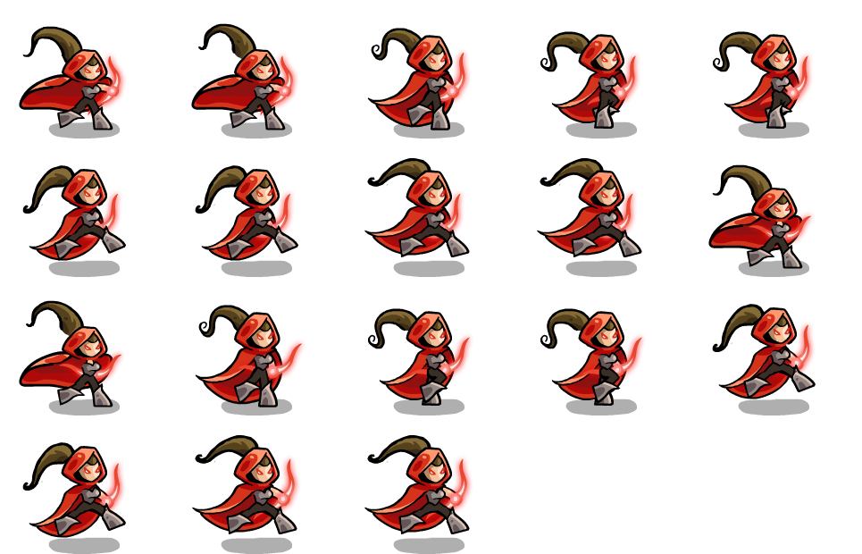

# Spritesheet Detector

`spritesheet_detector` is a Rust library that analyzes a spritesheet image and detects its grid layout and non-empty frame count. It can handle spritesheets with margin/padding (based on the color at the top-left pixel) and works even if the last row of frames is incomplete.

## Features

- Detects sprite frame dimensions.
- Determines the number of columns and rows in the spritesheet.
- Counts only the valid frames (ignoring cells that are completely the margin color).
- Supports a shortcut for square frames when the image width is evenly divisible by its height.

it was made for this type of spritesheet:


## Usage

```rust

use image::open;
use spritesheet_detector::{analyze_spritesheet, SpritesheetInfo};

fn main() {
// Open your spritesheet image.
let img = open("path/to/spritesheet.png").expect("Failed to open image");

    // Analyze the spritesheet.
    let info: SpritesheetInfo = analyze_spritesheet(&img);

    // Print the detected information.
    println!(
        "Sprite frame: {}x{} with {} columns and {} rows, {} valid frames.",
        info.sprite_width, info.sprite_height, info.columns, info.rows, info.frame_count
    );

}
```
